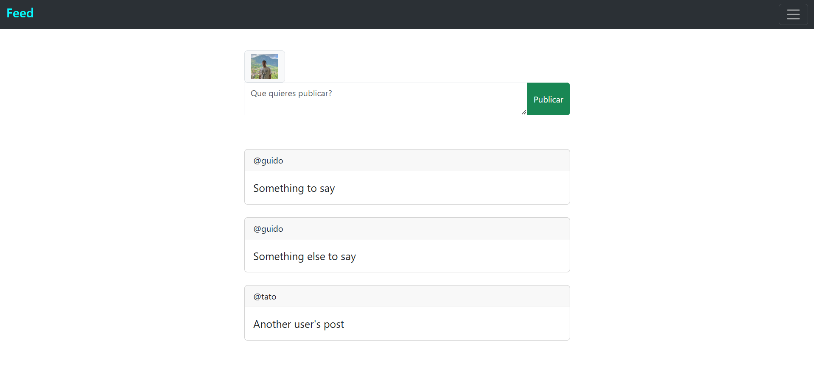
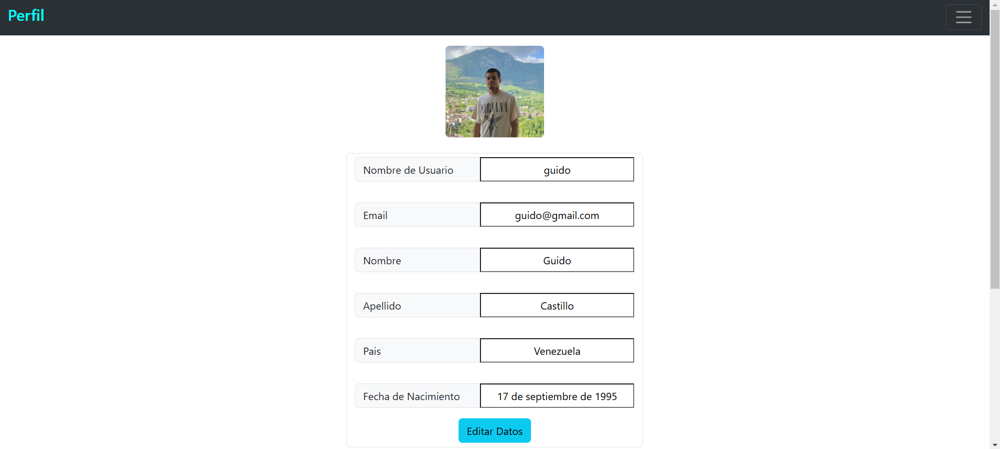
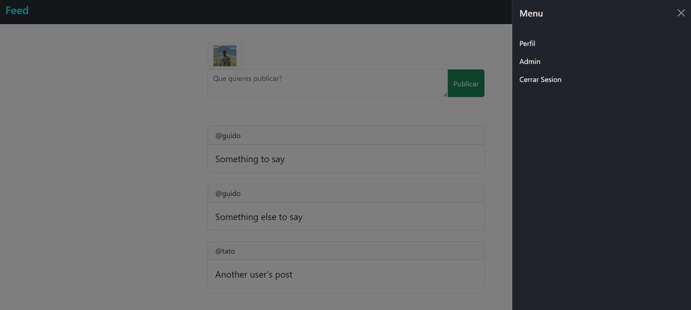

# Web User Profile 👤

Web App con estilo de una red social sencilla.

## 🖼️ Capturas

## 📋 Características

- Un usuario puede registrarse e iniciar sesión.
- Ver tu perfil con tus datos y foto.
- Actualizar datos de tu usuario.
- Crear una publicacion.
- Ver el feed con las publicaciones de los usuarios.
- Eliminar tus publicaciones.

## 🛠️ Tecnologías Utilizadas

- Python
- Django
- Bootstrap